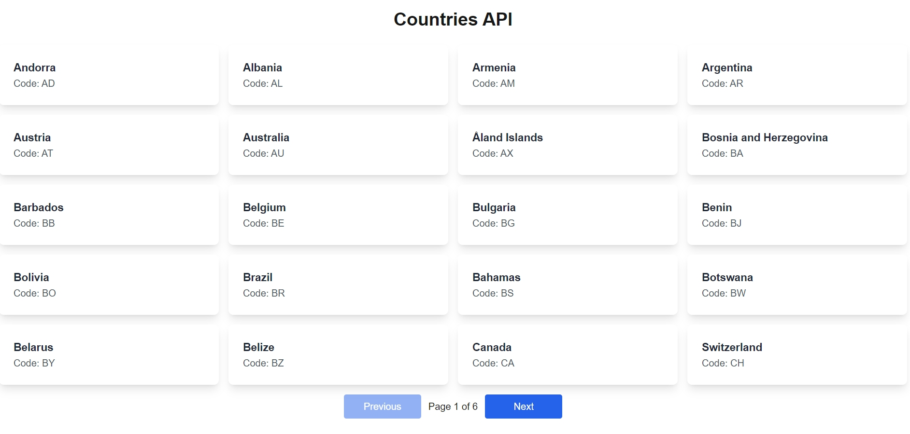
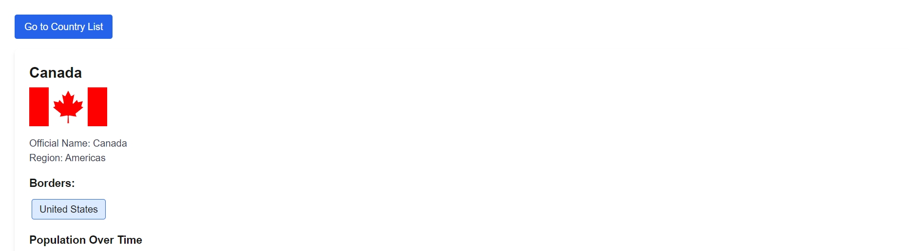
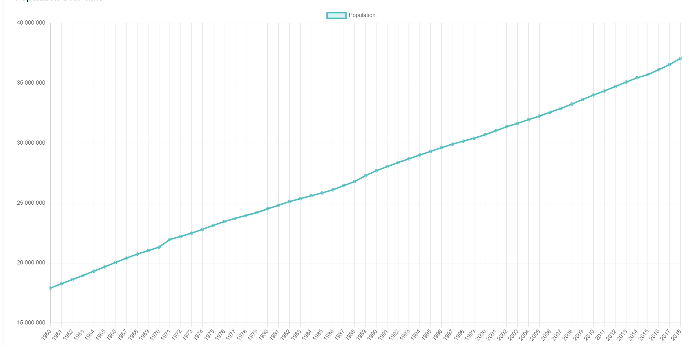
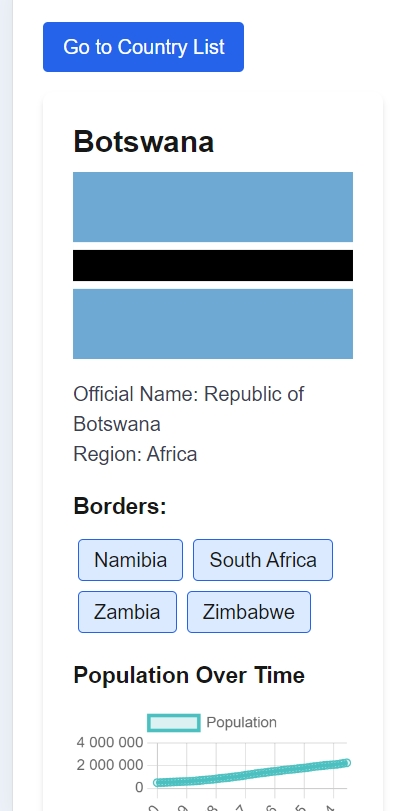

# Country API

---

## _The Simple Board and Task Manager_

[](https://img.shields.io/badge/node.js-339933?style=for-the-badge&logo=Node.js&logoColor=white) [](https://img.shields.io/badge/Express%20js-000000?style=for-the-badge&logo=express&logoColor=white) [](https://shields.io/badge/TypeScript-3178C6?logo=TypeScript&logoColor=FFF&style=flat-square) [](https://shields.io/badge/react-black?logo=react&style=for-the-badge) [](https://img.shields.io/badge/next.js-000000?style=for-the-badge&logo=nextdotjs&logoColor=white) [](https://img.shields.io/badge/tailwindcss-0F172A?&logo=tailwindcss) [](https://img.shields.io/badge/Chart.js-FF6384?style=for-the-badge&logo=chartdotjs&logoColor=white)

## About

---

✨ Country API is very simple and user-friendly web application that provides basic info about countries all over the world. ✨

[](./assets/main_desk.jpg)

## Features

---

- The list of all available countries with pagination
- The info about one country reached by clicking on item in the list
- Cool chart about population in this country
- Navigation to another country by tag click on country page
- Nice loader and "No info" components
- Responsive design for mobile and tablet versions

> This application's backend is deployed on Google Cloud and you can reach frontend part on netlify.

### How working app looks like

---

[](./assets/country.jpg)

[](./assets/population.jpg)

[](./assets/mob.jpg)

## Installation

---

If you are a developer, you will need [Node.js](https://nodejs.org/) v20+. Don't forget to create .env files as shown in .env.example!

To run app locally, clone repo the navigate to backend folder and install dependencies:

```sh
cd backend
npm install
npm run start
```

Once the server started, you will see the message in terminal. After this open new tab in terminal and navigate to frontend folder, install dependencies and run your app.

```sh
cd frontend
npm install
npm run start
```

